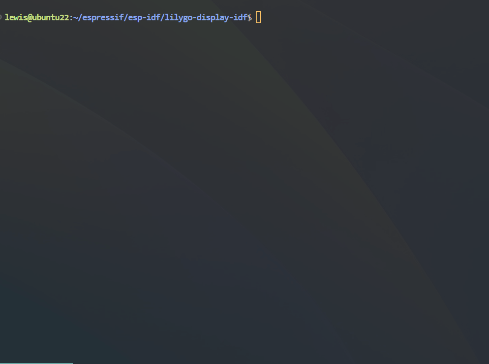

# 
<h1 align = "center">🌟LilyGo Display Series🌟</h1> 

## 🌟New

- This project is an esp-idf sample repository for the LilyGo display family.
- The sample currently only supports display and touch functions, and other board functions are not suitable for the time being.
- By default users using this repository example are configured with ESP-IDF. For novices, please first learn how to start the simplest HelloWord [Getting Started Guide](https://docs.espressif.com/projects/esp-idf/en/latest/get-started/index.html)

## 1️⃣Support Product

| Product(PinMap)                   | SOC           | Flash | PSRAM     | Resolution | Size      |
| --------------------------------- | ------------- | ----- | --------- | ---------- | --------- |
| [TTGO-T-Display][1]               | ESP32         | 4MB   | N.A       | 135x240    | 1.14 Inch |
| [T-QT-S3-FN4R2][2]                | ESP32-S3FN4R2 | 4MB   | 2MB(QSPI) | 128x128    | 0.85 Inch |
| [T-QT-S3-FN8][3]                  | ESP32-S3FN8   | 8MB   | N.A       | 128x128    | 0.85 Inch |
| [T-Display-S3 no Touch][4]        | ESP32-S3R8    | 16MB  | 8MB(OPI)  | 170x320    | 1.9 Inch  |
| [T-Display-S3 Touch][5]           | ESP32-S3R8    | 16MB  | 8MB(OPI)  | 170x320    | 1.9 Inch  |
| [T-Display-S3-Pro][6]             | ESP32-S3R8    | 16MB  | 8MB(OPI)  | 222x480    | 2.33 Inch |
| [T-Display-AMOLED-Lite][7]        | ESP32-S3R8    | 16MB  | 8MB(OPI)  | 194x368    | 1.47 Inch |
| [T-Display-S3 AMOLED no Touch][8] | ESP32-S3R8    | 16MB  | 8MB(OPI)  | 240x536    | 1.91 Inch |
| [T-Display-S3 AMOLED Touch][9]    | ESP32-S3R8    | 16MB  | 8MB(OPI)  | 240x536    | 1.91 Inch |
| [T4-S3 AMOLED ][10]               | ESP32-S3R8    | 16MB  | 8MB(OPI)  | 600x450    | 2.41 Inch |
| [T-Dongle-S3 ][11]                | ESP32-S3R8    | 16MB  | 8MB(OPI)  | 80x160     | 0.96 Inch |
| [T-Dongle-S2 ][12]                | ESP32-S2      | 4MB   | 8MB(QSPI) | 135x240    | 1.14 Inch |
| [T-HMI ][13]                      | ESP32-S3R8    | 16MB  | 8MB(OPI)  | 135x240    | 1.14 Inch |
| [T-Display-Long ][14]             | ESP32-S3R8    | 16MB  | 8MB(OPI)  | 135x240    | 1.14 Inch |
| [T-QT-C6 ][15]                    | ESP32-C6      | 4MB   | N.A       | 128x128    | 0.85 Inch |
| [T-RGB 2.1 inch Half Circle][16]  | ESP32-S3R8    | 16MB  | 8MB(OPI)  | 480x480    | 2.1 Inch  |
| [T-RGB 2.1 inch Full Circle][17]  | ESP32-S3R8    | 16MB  | 8MB(OPI)  | 480x480    | 2.1 Inch  |
| [T-RGB 2.8 inch Full Circle][18]  | ESP32-S3R8    | 16MB  | 8MB(OPI)  | 480x480    | 2.8 Inch  |

[1]: https://www.lilygo.cc/products/lilygo%C2%AE-ttgo-t-display-1-14-inch-lcd-esp32-control-board
[2]: https://www.lilygo.cc/products/t-qt-pro?variant=42562406121653
[3]: https://www.lilygo.cc/products/t-qt-pro?variant=42836336836789
[4]: https://www.lilygo.cc/products/t-display-s3?variant=42284559827125
[5]: https://www.lilygo.cc/products/t-display-s3?variant=42589373268149
[6]: https://www.lilygo.cc/products/t-display-s3-pro
[7]: https://www.lilygo.cc/products/t-display-amoled-lite
[8]: https://www.lilygo.cc/products/t-display-s3-amoled?variant=42837728526517
[9]: https://www.lilygo.cc/products/t-display-s3-amoled?variant=43228221636789
[10]: https://www.lilygo.cc/products/t4-s3
[11]: https://www.lilygo.cc/products/t-dongle-s3
[12]: https://www.lilygo.cc/products/t-dongle-esp32-s2-1-14-inch-lcd-board
[13]: https://www.lilygo.cc/products/t-hmi
[14]: https://www.lilygo.cc/products/t-display-s3-long
[15]: https://www.lilygo.cc/products/t-qt-c6
[16]: https://www.lilygo.cc/products/t-rgb?variant=42407295877301
[17]: https://www.lilygo.cc/products/t-rgb
[18]: https://www.lilygo.cc/products/t-rgb?variant=42880799441077

### 2️⃣ Build and Flash

1. Compiled and run on **Ubuntu 22.04 LTS**, other operating systems have not been tested
2. The example relies on **esp-idf V5.3.0**, Please see the [Getting Started Guide](https://docs.espressif.com/projects/esp-idf/en/latest/get-started/index.html) for full steps to configure and use esp-idf to build projects.
3. For the first run, enter `python ./setup.py` in the terminal,Each time you run `setup.py`, the compilation dependencies and temporary files will be cleared. If you do not need to change to other boards, you can only run it once.
   
4. Enter the board number you need to compile according to the terminal prompts, and press Enter to confirm.
5. After compilation is completed, Run `idf.py -p PORT flash monitor` to build, flash and monitor the project.

